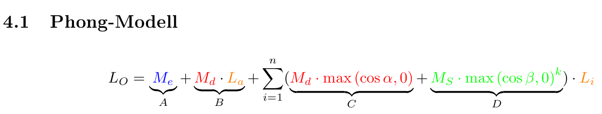

# Ex 4.1

### A: Emissive Material

> Das Object leuchtet selber

### B: Ambient Reflection

> Da wir (noch) kein raytracing haben, 
> strahlt einfach jedes Objekt ein bisschen

Diffuse Material * Global ambient light color

### C: Diffuse Reflection Model

> Je "orthogonaler" die Lichtquelle auf das Material trifft, desto heller wirkt dieses, 
> da selbe Protonen auf groesserer Flaeche wirken

Summe, da wir mehrere Lichtquellen einfach aufaddieren.

### D: Specular Model

> Heller Punkt, der Licht spiegelt.

# Ex 4.2

Falls das Licht von hinten kommt, soll nichts reflektiert werden
